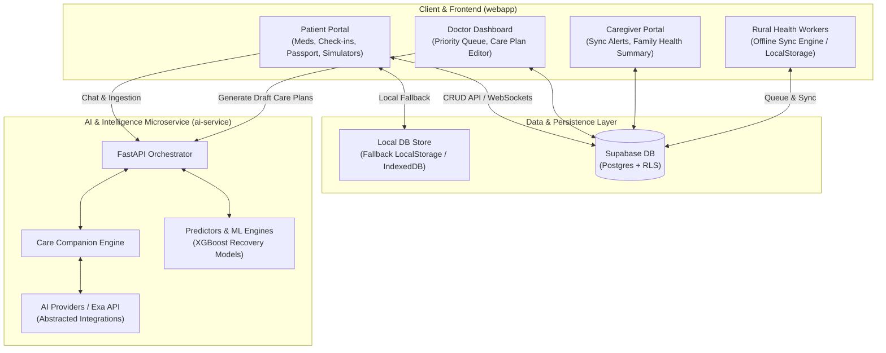
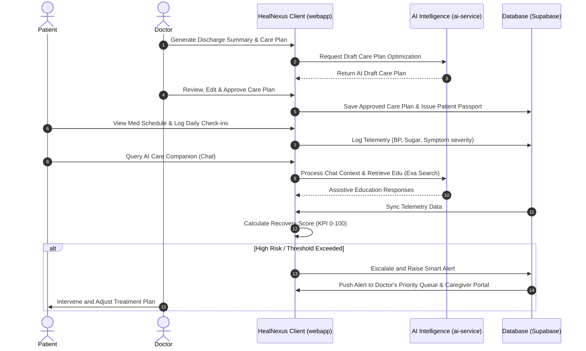

# HealNexus

**Connecting Patients, Doctors & AI Beyond Hospital Walls.**

HealNexus is a TypeScript-first, premium Continuity of Care platform. The core product lives in **`webapp/`** (React + business logic + Supabase). The Python **`ai-service/`** is dedicated exclusively to AI/ML and intelligence tasks (summarization, education, risk predictions) — keeping CRUD entirely within the webapp/Supabase layer.

> [!IMPORTANT]
> **Clinical Safety & AI Philosophy:** The AI Care Companion acts as an assistant. It never diagnoses, never prescribes, and never replaces clinical judgement. All AI outputs remain draft/assistive until reviewed and approved by a licensed doctor.

---

## 🏛️ System Architecture

HealNexus is built on a highly modular, decoupled architecture consisting of the TypeScript frontend product, a Supabase database layer, and a Python AI microservice.



---

## 🔄 Care Continuity Workflow



---

## 📂 Folder Layout

```text
HealNexus/
├── webapp/                 # Core TypeScript React application (Router, UI modules)
│   ├── src/
│   │   ├── modules/        # Domain features: marketing, caregiver, doctor, patient, rural
│   │   ├── components/     # UI elements (3D WebGL scenes, animated widgets, cards)
│   │   └── services/       # Repositories, health engines, API interfaces
├── ai-service/             # Python AI/ML microservice (FastAPI, prediction engines, providers)
│   ├── app/
│   │   ├── api/            # API routing & dependencies
│   │   ├── ml/             # Predictors & XGBoost simulation placeholders
│   │   └── services/       # Care companion, search assistants, and summary engines
├── supabase/               # Postgres schemas, migrations, and Row-Level Security
├── docs/                   # Architecture decision records (ADR) and SRS design specifications
└── assets/                 # Brand assets & logos
```

---

## ⚙️ Quick Start

### 1. Webapp Client (Core Product)
```bash
cd webapp
npm install
npm run dev
```
Open [http://localhost:5173](http://localhost:5173) to view the application.

**Local State Fallback**: Without Supabase credentials, the app automatically runs on a high-fidelity **dynamic local store**, allowing you to test patient check-ins, doctor queues, and offline rural synchronization entirely in the browser.

### 2. Python AI Service (Optional)
```bash
cd ai-service
python -m venv .venv
.venv\Scripts\activate
pip install -r requirements.txt
# Set EXA_API_KEY / OpenRouter credentials in ai-service/.env
uvicorn app.main:app --reload --port 8001
```

---

## 🛠️ Technology Stack
- **Frontend Core**: React 19, TypeScript, Vite, Tailwind CSS, Framer Motion, GSAP.
- **3D WebGL Interface**: Three.js, React Three Fiber (R3F), Drei.
- **Backend & DB**: Supabase (PostgreSQL, Realtime, Row-Level Security).
- **AI Microservice**: Python, FastAPI, Pydantic, XGBoost (scikit-learn), OpenRouter, Exa.
