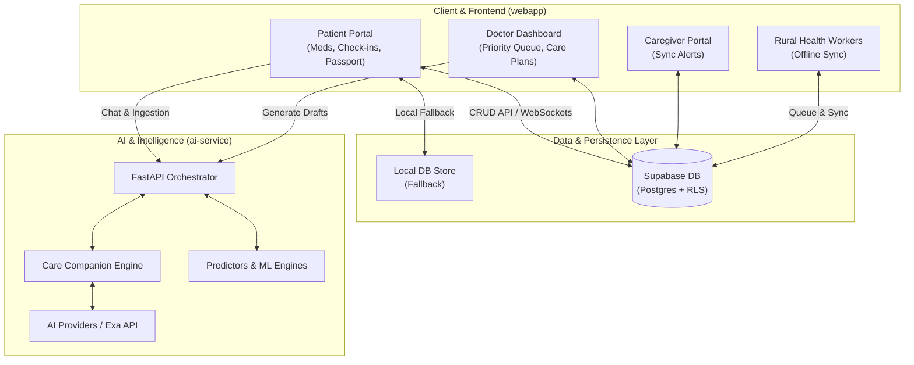
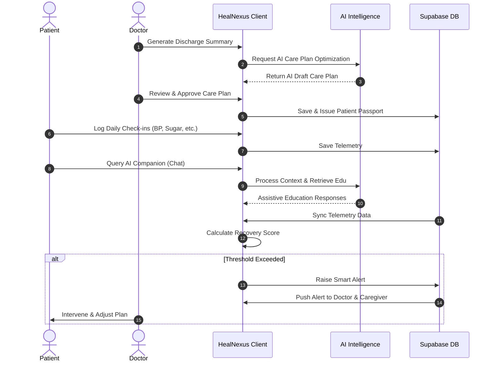

<div align="center">
  
# 🌟 HealNexus 🌟

**Connecting Patients, Doctors & AI Beyond Hospital Walls.**

[](https://www.typescriptlang.org/)
[](https://reactjs.org/)
[](https://fastapi.tiangolo.com/)
[](https://supabase.com/)
[](https://vitejs.dev/)

*A premium, AI-powered Continuity of Care platform designed for modern healthcare.*

</div>

---

## 🚀 Overview

HealNexus bridges the gap between clinical visits by empowering patients, caregivers, and doctors with real-time insights, AI-driven care plans, and robust offline sync for rural areas. 

The platform is split into two primary engines:
- **`webapp/`**: The core TypeScript frontend and business logic, powered by React and Supabase.
- **`ai-service/`**: A dedicated Python microservice handling AI/ML intelligence, risk predictions, and advanced context processing.

> [!IMPORTANT]
> **Clinical Safety & AI Philosophy:** Our AI Care Companion serves purely as a clinical assistant. It never diagnoses, prescribes, or replaces professional medical judgment. All AI outputs are drafts requiring licensed doctor approval.

---

## ✨ Key Features

- **🤖 AI Care Companion**: Intelligent chat that summarizes contexts, handles emergency triage, and fetches validated medical education.
- **📊 Real-time Doctor Dashboard**: Priority queues, live patient telemetry, and AI-assisted care plan generation.
- **👨‍👩‍👧‍👦 Caregiver Portal**: Allows family members to track recovery progress and receive critical health alerts.
- **🌍 Rural Health Sync**: Robust offline-first capabilities using LocalStorage to support health workers in low-connectivity areas.
- **🌐 Internationalization (i18n)**: Multi-language support (English, Hindi, Gujarati) catering to diverse patient demographics.
- **🎨 Stunning 3D Interfaces**: Immersive WebGL elements built with Three.js and Framer Motion.

---

## 🏛️ System Architecture

HealNexus leverages a highly decoupled, scalable architecture:



---

## 🔄 Care Continuity Workflow



---

## 📂 Folder Layout

```text
HealNexus/
├── webapp/                 # Core TS React app (Router, UI, i18n, Realtime)
│   ├── src/
│   │   ├── modules/        # Domain features: marketing, caregiver, doctor, patient
│   │   ├── components/     # UI elements (3D WebGL scenes, widgets, cards)
│   │   └── services/       # Repositories, health engines, API interfaces
├── ai-service/             # Python AI/ML microservice
│   ├── app/
│   │   ├── api/            # API routing & FastAPI dependencies
│   │   ├── ml/             # Predictors & XGBoost simulation placeholders
│   │   └── services/       # Care companion & search assistants
├── supabase/               # Postgres schemas, migrations, and Row-Level Security
└── docs/                   # Architecture decision records & design specs
```

---

## ⚙️ Quick Start

### 1. Webapp Client (Core Product)
```bash
cd webapp
npm install
npm run dev
```
Open [http://localhost:5173](http://localhost:5173) to view the application.

> **💡 Note on Local State Fallback**: Without Supabase credentials, the app gracefully degrades to a **dynamic local store**, allowing testing of patient check-ins and offline rural synchronization entirely in the browser.

### 2. Python AI Service (Optional)
```bash
cd ai-service
python -m venv .venv
# On Windows: .venv\Scripts\activate
# On Mac/Linux: source .venv/bin/activate
pip install -r requirements.txt

# Create .env and set EXA_API_KEY / OpenRouter credentials
uvicorn app.main:app --reload --port 8001
```

---

## 🛠️ Technology Stack

- **Frontend Core**: React 19, TypeScript, Vite, Tailwind CSS, Framer Motion, GSAP, i18next.
- **3D WebGL Interface**: Three.js, React Three Fiber (R3F), Drei.
- **Backend & DB**: Supabase (PostgreSQL, Realtime, Row-Level Security).
- **AI Microservice**: Python, FastAPI, Pydantic, XGBoost, OpenRouter, Exa.

<div align="center">
  <p>Built with ❤️ for a healthier tomorrow.</p>
</div>
